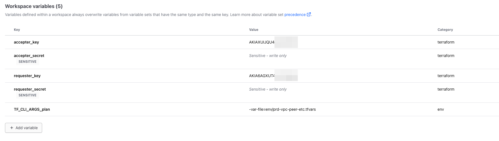

# REF >

<!-- BEGIN_TF_DOCS -->

## vpc-p2p-request-accept-with-route

===

용도:

- 서로다른 AWS 계정의 VPC 간의 피어링 및 라우팅 셋업

===
vars 예시 >

```yaml
###############################################################################
# var defintion
###############################################################################

# key & secret 정보 tfc 콘솔상에 기재
# 참고로 TFC 에서 String input 만 지원함으로 MAP 객체변수 사용 불가

#requester
variable "requester_key" { default = "" }
variable "requester_secret" { default = "" }

variable "accepter_key" { default = "" }
variable "accepter_secret" { default = "" }

variable "requester_vpc_id" { default = "" }
variable "requester_vpc_name" { default = "" }
variable "requester_vpc_cidr" { default = "" }
variable "requester_route_tables_ids" { default = [] }

#accepter
variable "accepter_vpc_list" {
  description = "A list of maps containing key/value pairs that define vpc peering."

  type = map(object({
    vpc_id       = optional(string, "")
    vpc_cidr        = optional(string, "")
    acpt_vpc_name       = optional(string, "")

  }))
}
```

#### 민감한 정보는 보안상의 이유로 tfc 콘솔상에 별도 기재




tfvars 예시 >

```yaml

########################################
# vpc-peer-about
########################################

requester_vpc_id = "vpc-037a4fd4fdd220e52"
requester_vpc_cidr = "10.100.0.0/16"
requester_vpc_name = "TEST-2023-VPC"

# Peering List
accepter_vpc_list =  {
  # accpeter = {
  #     vpc_id                      = "<< VPC ID >>"
  #     vpc_cidr                         = "<< VPC CIDR >>"
  #     owner_id                    = "<< Owner Account ID >>"
  #     acpt_vpc_name                    = "<< Peering VPC Name >>"
  # }

  accepter = {
      vpc_id                      = "vpc-0e8acf616f7d0dd34"
      vpc_cidr                         = "10.20.0.0/16"
      owner_id                    = "<< Owner Account ID >>"
      acpt_vpc_name                    = "TEST-ACCEPTER-VPC"
  }

}

```

<!-- END_TF_DOCS -->
